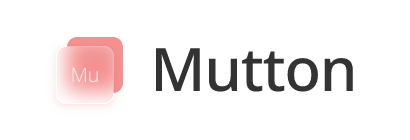
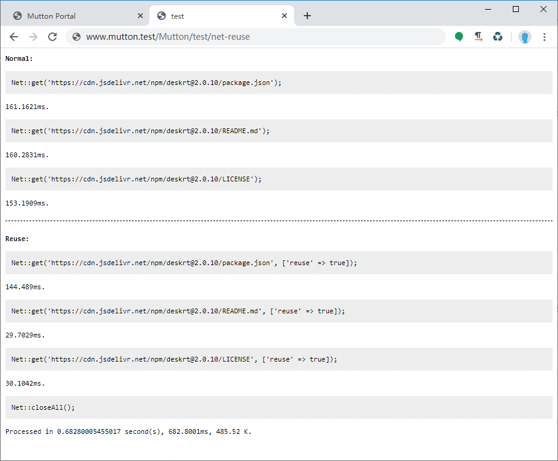

<p align="center"></p>

[](https://github.com/maiyun/Mutton/blob/master/LICENSE)
[](https://github.com/maiyun/Mutton/issues)
[](https://github.com/maiyun/Mutton/releases "Stable Release")
[](https://github.com/maiyun/Mutton/releases "Pre-Release")

Simple, easy to use, full functionality of the PHP framework.

## Languages

[简体中文](doc/README.sc.md) | [繁體中文](doc/README.tc.md)

## Requirement

PHP 8.0+  
Nginx/Apache

## Installation

Download the latest release and put it to directory, then enjoy.

> Note: Under Nginx, you need to manually configure the rewrite rule with the following rewrite rules:

```
if ($request_uri !~ ^/(stc/.*|favicon.\w+?\??.*|apple[\w-]+?\.png\??.*|[\w-]+?\.txt\??.*)$) {
    rewrite ^/([\s\S]*)$ /index.php?__path=$1 last;
}
```

## Library

Captcha, Crypto, Db (MySQL, Sqlite), Fs, Kv (Redis, RedisSimulator), Net, Scan, Session, Sql, Text.

## Features

### No brains

Simple and easy-to-use interface with rich code tips (phpDoc-based).

### Autoload

Using the various libraries directly, the system loads them automatically.

### Super-friendly Net library

You can use like:

```php
$res = Net::open('https://xxx/test')->post()->data(['a' => '1', 'b' => '2'])->request();
```

You can also use like:

```php
$res = Net::get('https://xxx/test');
```

You can set custom dns results:

```php
$res = Net::get('https://xxx/test', [
    'hosts' => [
        'xxx' => '111.111.111.111'
    ]
]);
```

You can also select another local network interface card:

```php
$res = Net::get('https://xxx/test', [
    'local' => '123.123.123.123'
]);
```

You can also possible to reuse links when accessing multiple urls, greatly speeding up access:

```php
$res1 = Net::get('https://xxx/test1', [
    'reuse' => true
]);
$res2 = Net::get('https://xxx/test2', [
    'reuse' => true
]);
Net::closeAll();
```

[](doc/test-net-reuse.png)

With a complete cookie manager, cookies can be easily obtained and exist anywhere, when a request is sent, the system will also choose to send based on the domain name, path, etc. set by the cookie, and Set-Cookie will be discarded if it is set illegally across domains. Just like a real browser:

```php
$res1 = Net::get('https://xxx1.xxx/test1', [], $cookie);
$res2 = Net::get('https://xxx2.xxx/test2', [], $cookie);
```

> Tip: Net library support both incoming options and open chain operation, such as Net::open('xxx')->follow()->timeout(60)->reuse()->save(ROOT_PATH . 'doc/test.txt')->request();.

### Perfect Db library

With a number of useful interfaces, you can easily filter out the required data from the database:

```php
$ls = Order::where([
    'state' => '1'
])->by('id', 'DESC')->page(10, 1);
$list = $ls->all();
$count = $ls->count();
$total = $ls->total();
```

Get a user:

```php
$user = User::select(['id', 'user'])->filter([
    ['time_add', '>=', '1583405134']
])->first();
```

### XSRF

The checkXInput method enables XSRF detection to prevent malicious access.

### Mainland China library support

For WeChat payment, WeChat login, Alibaba Cloud OSS, Tencent Cloud COS, Alipay payment has been completed package.(Due to the kernel framework update upgrade, these libraries have not yet been updated, temporarily removed, will be updated soon)

#### And more...

## Demonstrate

### Generate 16-bit random numbers

```php
$str = $this->_random(16, Ctr::RANDOM_N);
```

### Generate a verification code picture

```php
Captcha::get(400, 100)->getBuffer();
```

### Get a list

```php
$userList = User::where([
    ['state', '!=', '0'],
    'type' => ['1', '2', '3'],
    'is_lock' => '0'
])->all();
```

Note: All database operations are secure in this framework.

## Other demos

You can download and view the home Code (ctr/test.php) to see more examples.

## Changelog

[Changelog](doc/CHANGELOG.md)

## License

This library is published under [Apache-2.0](./LICENSE) license.

## Name meaning

Sheep are so cute.

## 参与翻译

我们工作基于中文语言环境，若对本项目感兴趣并对除中文简体、中文繁体之外语种熟悉的朋友，欢迎一起参与翻译工作，感兴趣的朋友可以加入以下群组。

Telegram 群：[https://t.me/maiyunlocale](https://t.me/maiyunlocale)  
QQ 群：24158113