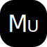

<p align="center"></p>

[](https://github.com/maiyun/mutton/blob/master/LICENSE)
[](https://github.com/maiyun/mutton/issues)
[](https://github.com/maiyun/mutton/releases "Stable Release")
[](https://github.com/maiyun/mutton/releases "Pre-Release")

簡單、易用且功能完整的 PHP 框架。

## 語言

[English](../README.md) | [简体中文](README.sc.md)

## 環境

PHP 8.0 +

## 安裝

下載最新的發行包，解壓後即可。

> 提示：在 Nginx 中，你需要將以下規則添加到重新規則檔內：

```
if ($request_uri !~ ^/(stc/.*|favicon.\w+?\??.*|apple[\w-]+?\.png\??.*|[\w-]+?\.txt\??.*)$) {
    rewrite ^/([\s\S]*)$ /index.php?__path=$1 last;
}
```

## 庫

Captcha, Consistent, Crypto, Db (MySQL, SQLite), Fs, Kv (Redis, RedisSimulator), Net, Scan, Session, Jwt, Sql, Text.

## 特性

### 開袋即食

秉承開袋即食的原則，封裝統一風格的常用類庫。

### 自動載入

直接使用各種庫，系統會自動載入它。

### 超好用 Net 庫

可以這樣用：

```php
$res = Net::open('https://xxx/test')->post()->data(['a' => '1', 'b' => '2'])->request();
```

也可以這樣用：

```php
$res = Net::get('https://xxx/test');
```

可以設置自訂的解析結果：

```php
$res = Net::get('https://xxx/test', [
    'hosts' => [
        'xxx' => '111.111.111.111'
    ]
]);
```

也可以選擇本地的其他網卡來訪問：

```php
$res = Net::get('https://xxx/test', [
    'local' => '123.123.123.123'
]);
```

更可以在訪問多條 url 時進行連結複用，大大加快存取速度：

```php
$res1 = Net::get('https://xxx/test1', [
    'reuse' => true
]);
$res2 = Net::get('https://xxx/test2', [
    'reuse' => true
]);
Net::closeAll();
```

[](test-net-reuse.png)

更擁有完整的 Cookie 管理器，可以輕鬆將 Cookie 獲取並存在任何地方，發送請求時，系統也會根據 Cookie 設置的功能變數名稱、路徑等來選擇發送，並且 Set-Cookie 如果有非法跨域設置，也會被捨棄不會被記錄，就像真正的瀏覽器一樣：

```php
$res1 = Net::get('https://xxx1.xxx/test1', [], $cookie);
$res2 = Net::get('https://xxx2.xxx/test2', [], $cookie);
```

> 提示：Net 庫同時支援傳入 options 和 open 鏈式操作，如 Net::open('xxx')->follow()->timeout(60)->reuse()->save(ROOT_PATH . 'doc/test.txt')->request();。

### 好用的 Db 庫

擁有大量好用的介面，可以輕鬆的從資料庫篩選出需要的資料：

```php
$ls = Order::where([
    'state' => '1'
])->by('id', 'DESC')->page(10, 1);
$list = $ls->all();
$count = $ls->count();
$total = $ls->total();
```

獲取一個使用者：

```php
$user = User::select(['id', 'user'])->filter([
    ['time_add', '>=', '1583405134']
])->first();
```

### XSRF 檢測

使用 checkXInput 方法，可以進行 XSRF 檢測，防止惡意訪問。

### 扫码登录

借助 Scan 庫可以輕鬆實現掃碼登入的功能。

#### 還有更多特性等你探索

## 部分示例

### 創建 16 位亂數

```php
$str = Core::random(16, Core::RANDOM_N);
```

### 創建一個驗證碼

```php
Captcha::get(400, 100)->getBuffer();
```

### 獲取一個清單

```php
$userList = User::where([
    ['state', '!=', '0'],
    'type' => ['1', '2', '3'],
    'is_lock' => '0'
])->all();
```

提示：所有資料庫操作都已經做了安全防注入處理。

### Sql 庫自動增加表前綴和包裹字元「`」”

```php
$sql->select(['SUM(user.age) age'], 'order')->leftJoin('user', ['order.user_id' => '#user.id'])
```

將輸出：

```sql
SELECT SUM(`test_user`.`age`) AS `age` FROM `test_order` LEFT JOIN `test_user` ON `test_order`.`user_id` = `test_user`.`id`
```

寫起來好輕鬆！

### 本地化

```php
$this->_loadLocale($_GET['lang'], 'test');
echo l('copy');
```

根據 lang 值不同，將輸出：Copy、复制、複製、コピー等，在目錄 /data/locale/ 中配置。

### 數據校驗

根據字串、數位、比對大小甚至是正則，對提交的數據進行直接校驗，方便！

```php
[
    'he' => ['require', [0, 'The he param does not exist.']],
    'num' => ['> 10', [0, 'The num param must > 10.']],
    'reg' => ['/^[A-CX-Z5-7]+$/', [0, 'The reg param is incorrect.']],
    'arr' => [['a', 'x', 'hehe'], [0, 'The arr param is incorrect.']]
]
```

參見：/test/ctr-checkinput

## 其他示例

你可以訪問 /test/ 來查看更多示例。

## 更新日誌

[更新日誌](CHANGELOG.tc.md)

## 許可

基於 [Apache-2.0](../LICENSE) 許可。

## 參與翻譯

我們工作基於中文語言環境，若對本專案感興趣並對除中文簡體、中文繁體之外語種熟悉的朋友，歡迎一起參與翻譯工作，感興趣的朋友可以加入以下群組。

Telegram 群：[https://t.me/maiyunlocale](https://t.me/maiyunlocale)  
QQ 群：24158113