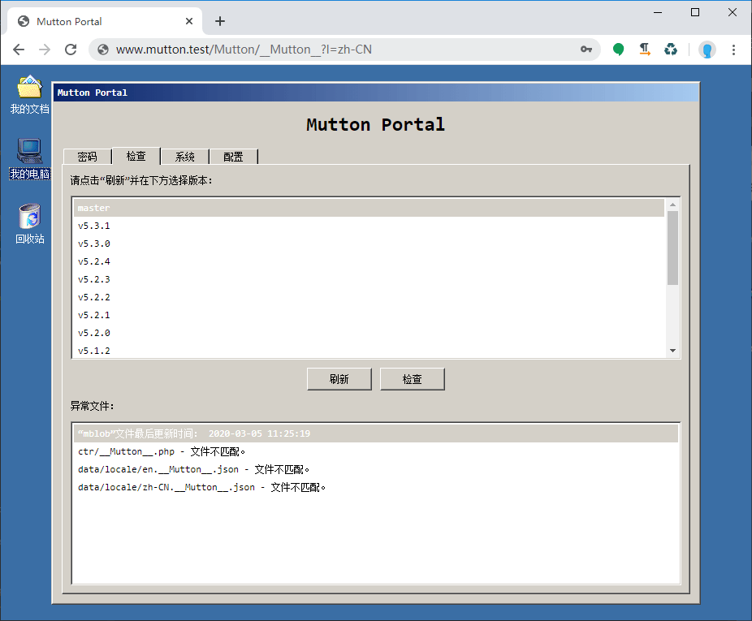
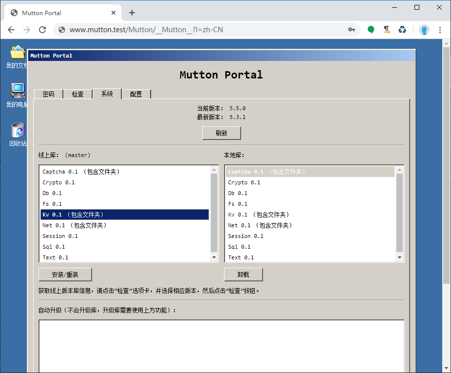

# Mutton

[](https://github.com/MaiyunNET/Mutton/blob/master/LICENSE)
[](https://github.com/MaiyunNET/Mutton/issues)
[](https://github.com/MaiyunNET/Mutton/releases "Stable Release")
[](https://github.com/MaiyunNET/Mutton/releases "Pre-Release")

简单、易用且功能完整的 PHP 框架。

## 语言

[English](../README.md) | [繁體中文](README.zh-TW.md)

## 环境

PHP 7.3+  
Nginx/Apache

## 安装

下载最新的发行包，解压后即可。

> 提示：在 Nginx 中，你需要将以下规则添加到重新规则文件内：

```
if ($request_uri !~ ^/(stc/.*|favicon.\w+?\??.*|apple[\w-]+?\.png\??.*|[\w-]+?\.txt\??.*)$) {
    rewrite ^/([\s\S]*)$ /index.php?__uri=$1 last;
}
```

## 库

Captcha, Crypto, Db (MySQL, Sqlite), Kv (Memcached, Redis, RedisSimulator), Net, Session, Sql, Text.

## 特性

### 开袋即食

秉持开袋即食的原则，封装了大量接口，简约而不简单，并且拥有丰富的代码提示（基于 PHPDoc）。

### 自动加载

直接使用各种库，系统会自动加载它。

### Mutton Portal

基于 GUI 优先原则，Mutton 附带可视化控制台，可以进行本地代码文件与线上版本文件异同检测、版本检测以及框架升级等功能。

[](portal-check-zh-CN.png)

[](portal-system-zh-CN.png)

### 超好用 Net 库

可以这样用：

```php
$res = Net::open('https://xxx/test')->post()->data(['a' => '1', 'b' => '2'])->request();
```

也可以这样用：

```php
$res = Net::get('https://xxx/test');
```

可以设置自定义的解析结果：

```php
$res = Net::get('https://xxx/test', [
    'hosts' => [
        'xxx' => '111.111.111.111'
    ]
]);
```

也可以选择本地的其他网卡来访问：

```php
$res = Net::get('https://xxx/test', [
    'local' => '123.123.123.123'
]);
```

更可以在访问多条 url 时进行链接复用，大大加快访问速度：

```php
$res1 = Net::get('https://xxx/test1', [
    'reuse' => true
]);
$res2 = Net::get('https://xxx/test2', [
    'reuse' => true
]);
Net::closeAll();
```

[](test-net-reuse.png)

更拥有完整的 Cookie 管理器，可以轻松将 Cookie 获取并存在任何地方，发送请求时，系统也会根据 Cookie 设置的域名、路径等来选择发送，并且 Set-Cookie 如果有非法跨域设置，也会被舍弃不会被记录，就像真正的浏览器一样：

```php
$res1 = Net::get('https://xxx1.xxx/test1', [], $cookie);
$res2 = Net::get('https://xxx2.xxx/test2', [], $cookie);
```

### 好用的 Db 库

拥有大量好用的接口，可以轻松的从数据库筛选出需要的数据：

```php
$ls = Order::where([
    'state' => '1'
])->by('id', 'DESC')->page(10, 1);
$list = $ls->all();
$count = $ls->count();
$total = $ls->total();
```

获取一个用户：

```php
$user = User::select(['id', 'user'])->filter([
    ['time_add', '>=', '1583405134']
])->first();
```

### XSRF 检测

使用 checkXInput 方法，可以进行 XSRF 检测，防止恶意访问。

### 中国大陆库支持

完整封装了微信支付、微信登录、阿里云 OSS、腾讯云 COS、阿里巴巴等中国特有服务的支持。（因内核框架更新升级，这些库还未来得及更新，暂时移除，将很快进行更新）

#### 还有更多特性等你探索

## 部分示例

### 创建 16 位随机数

```php
$str = $this->_random(16, Ctr::RANDOM_N);
```

### 创建一个验证码

```php
Captcha::get(400, 100)->getStream();
```

### 获取一个列表

```php
$userList = User::where([
    ['state', '!=', '0'],
    'type' => ['1', '2', '3'],
    'is_lock' => '0'
])->all();
```

提示：所有数据库操作都已经做了安全防注入处理。

## 其他示例

你可以访问 ctr/test.php 来查看更多示例。

## 更新日志

[更新日志](CHANGELOG.zh-CN.md)

## 许可

基于 [Apache-2.0](../LICENSE) 许可。

## 名称含义

羊肉他不香吗？

## 参与翻译

我们工作基于中文语言环境，若对本项目感兴趣并对除中文简体、中文繁体之外语种熟悉的朋友，欢迎一起参与翻译工作，感兴趣的朋友可以加入以下群组。

除中国大陆之外翻译 Telegram 群组：[https://t.me/maiyunlocal](https://t.me/maiyunlocal)  
中国大陆翻译 QQ 群：24158113